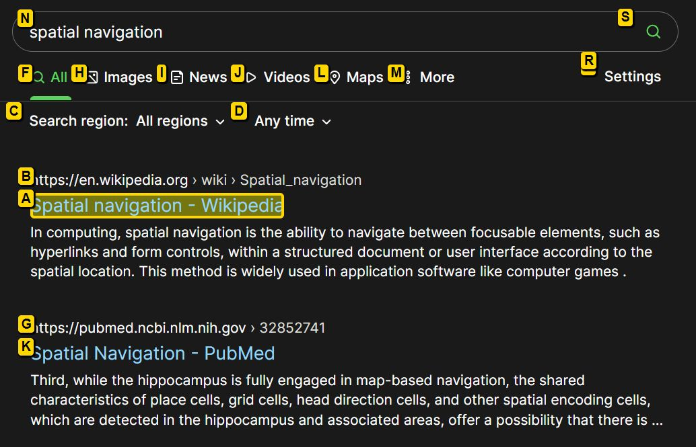

# Spatialnavigation

__Spatial Navigation Chrome Extension__

Smart spatial navigation with key map to links.

Based off the *[Spatial Navigation](https://github.com/falsandtru/spatial-navigation)* extension by Falsandtru.

Binds WASD, F, E and Q keys for navigation/hints mode.

- `W/A/S/D`: Four-way spatial navigation
- `E/Shift+E`: Expand/Contract (change link targets)
- `Q`: Quit navigation/hints mode
- `Enter/F`: Click link
- `Shift+Enter/Shift+F`: Shift-click link (open new tab)
- `Ctrl+Enter/Ctrl+F`: Ctrl-click link (open new background tab)
- `Ctrl+Shift+X`: Disable the hotkeys for current tab

Set your own keys: Click the icon and choose Options, or visit the details page in the browser extension manager.

Any contributions are most welcome! 🤓👍

### Screenshot

### Installation

- Clone this repo, or download and unpack it to your file system.
- Open your browser's *Manage Extensions* page.
- Enable Developer Mode.
- Click 'Load Unpacked'.
- In the file picker navigate to the extension's folder containing the `manifest.json` file and click 'Select Folder'.
- The extension is now installed.

To update the extension do a `git pull` in the repo folder, or download again and unzip to the same folder.\
Then click the Reload button or disable then enable it again to update.

### Notes

This extension is far from feature complete, and some things just don't work as expected.
The inherited code is also a bit of a mess, and since I am no JS coder there's limits to what can be done.
As this started as a very personal extension for my use, some things are the way I want them and not easily changed.

Here are some of the more common issues/bugs/TODOs and some tips:

- Changing keys in options require a tab reload to take effect.

- Using `Ctrl+<link key>` in hints mode does not work. Using `Shift+<link key>` works for opening in a new tab though.

- The default `Ctrl+F` interferes with the common browser shortcut for Find-In-Page. I suggest using something else for Find, like F3, or changing the key to for instance `G`.

- Even if keys are changed, there might be conflicts with the link hints as they are hard-coded, see below.

- The extension uses a hard-coded list of link hint keys. These might interfere with common browser keys, especially if single-key shortcuts are used in the browser. If so these will need to be removed from the list.

- The list of available link hint keys are in `spatial-navigation.js`:\
`var keys = 'abcdfghijklmnoprstuvwxyz'`\
You can edit this string and reload the extension. You can also add keys you want to use instead, for instance the number keys (if not used for anything else).

- The CSS styles for links/hints/url display can if necessary be changed by editing the following values in `spatial-navigation.js`:\
`this.style.innerHTML`\
`marker.style.cssText`\
`display.style.cssText`

- There are no language options or internationalization.
